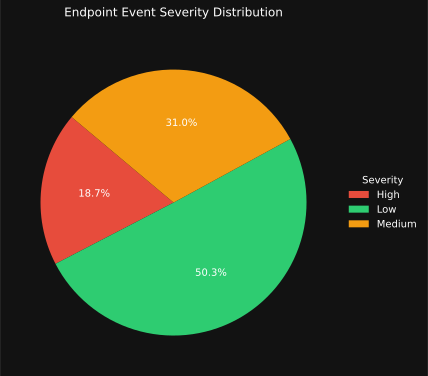

# XDR-EDR-Analytics 🛡️

**Real-Time Endpoint Threat & Risk Visualization for Blue Teams**

---

## 🔹 Purpose
XDR-EDR-Analytics simulates **endpoint activity** in a realistic corporate environment to help security analysts visualize and understand host risk.  
Built for **blue team training, analytics, and trend monitoring**, it emphasizes **live, automated, and actionable endpoint telemetry**.  

- Simulates **auth failures, suspicious processes, PowerShell misuse, and other endpoint anomalies**  
- Calculates **risk scores per host** based on event frequency and severity  
- Generates **dark-mode dashboards** that update daily  
- Fully automated using **Python, SQLite, Matplotlib, and GitHub Actions**  

---

## 🧩 How It Works
- **Telemetry** – Generates realistic endpoint events for multiple hosts and stores them in a persistent SQLite database  
- **Risk Scoring** – Calculates dynamic host risk based on severity and frequency of detected behaviors  
- **Dashboard** – Produces a clean dark-mode SVG dashboard showing trends and high-risk hosts  
- **Automation** – GitHub Actions updates the simulation **twice daily** or manually; historical data is preserved  

---

## 📈 Live Dashboard
  
*⚠️Automatically updates twice daily with new telemetry and risk scores.*

---

## 🔍 Analyst Insights
- Quickly identify **high-risk hosts**  
- Track **endpoint activity trends** over time  
- Practice **incident response and risk prioritization** with live simulated data  
- Train teams using **realistic, continuously updating datasets**

---

**XDR-EDR-Analytics** combines **automation, live data, and visualization** into a polished tool for security operations, threat detection, and blue-team readiness.
